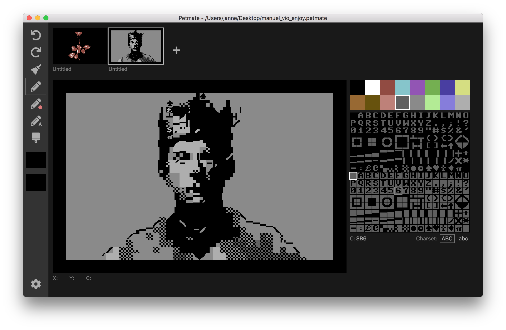

# Petmate

Petmate is a cross-platform C64 PETSCII image editor, drawing inspiration from the [PETSCII](http://www.kameli.net/marq/?page_id=2717) editor.

Petmate runs locally on a Mac/Windows/Linux machine and doesn't require an internet connection.

## Download Petmate
{:.downloads}
* MacOS: <a href='http://nurpax.com/petmate/releases/mac/Petmate-0.4.0.dmg'>Petmate-0.4.0.dmg</a>
* Windows: <a href='http://nurpax.com/petmate/releases/win/Petmate%20Setup%200.4.0.exe'>Petmate Setup 0.4.0.exe</a>
* Linux: <a href='http://nurpax.com/petmate/releases/linux/petmate_0.4.0_amd64.deb'>petmate_0.4.0_amd64.deb</a>

## Features

- Commodore 64 standard character mode graphics with the uppercase system ROM character set
- Drawing operations: draw character, colorize a character, select brush, draw with brush
- Undo/redo stack
- Multiple screens (each with their own undo stack)
- Save/load workspace as a .petmate file (.petmate is the native file format for this editor)
- Export and import other common PETSCII file formats:
  - Bitmap .png (export)
  - PETSCII .c format (import, export)
  - Executable .prg (export)
  - Assembler .asm (export for KickAssembler, 64tass and ACME)

This project is work-in-progress.  You can view [github issues](https://github.com/nurpax/petmate/issues) for upcoming features/fixes.

## Keyboard shortcuts

- `ESC`: Reset brush selection
- `a`, `s`, `d`, `w`: Move left/down/right/up in the character selector
- `q`, `e`: Select prev/next color
- `f`: Select the inverted version of the currently selected char.
- `h`, `v`: Flip brush horizontally/vertically
- `r`: Rotate current brush or character counterclockwise
- `x`, `c`, `3`, `b`: Select tool (draw/colorize/char-only draw/brush)
- `1`, `2`, `3`, `4`, `5`: Select tool (draw/colorize/char-only draw/brush/text)
- `g`: Toggle grid
- `Alt-Left Click`: Select character and color under cursor
- `Start drawing while holding SHIFT`: Lock vertical or horizontal movement for drawing straight lines
- `⌘1-4 / Ctrl+1-4`: Switch between palettes.  Use the Preferences pane to configure palettes
- `Left/right arrows`: Move to previous/next screen

Open/Save/Save As: use platform shortcuts (e.g., Save is `Ctrl+S` on Windows, `⌘S` on Mac).

Undo/Redo: use platform shortcuts (e.g., `⌘Z` and `⌘⇧Z` on Mac).

## Preferences

The settings are saved in the following location:

- macOS: `~/Library/Application\ Support/Petmate/Settings`
- Windows: `%APPDATA%/Petmate/Settings`
- Linux: `$XDG_CONFIG_HOME/Petmate` or `~/.config/Petmate`

## Release history

Petmate 0.4.1 (2018-09-04)
- Add 32-bit build for Windows.
- Fix several keyboard shortcut related bugs: [#112](https://github.com/nurpax/petmate/issues/112), [#111](https://github.com/nurpax/petmate/issues/111), [#105](https://github.com/nurpax/petmate/issues/105), [#97](https://github.com/nurpax/petmate/issues/97)

Petmate 0.4.0 (2018-09-02)
- Re-order screens by dragging.  Assign names to screens that get output to exported .asm file symbol names.
- Text input tool.
- Upper/lower case font support.
- Resize painting canvas relative to window size.  Check the Settings pane for options related to this.
- Improved performance.

Petmate 0.3.2 (2018-08-21)
- Layout changes: change the size and position of the color picker ([#93](https://github.com/nurpax/petmate/issues/93)) and make the top thumbnails bigger ([#91](https://github.com/nurpax/petmate/issues/91))
- Add 'find the inverted version of the current char' feature.  This is bound to the 'f' key
- Bug fix: The Alt key (or Ctrl on macOS) would get stuck in down state when tabbing in and out of Petmate ([#94](https://github.com/nurpax/petmate/issues/94))

Petmate 0.3.1 (2018-08-16)
- Display current mouse x,y character coordinates and screencode under cursor ([#88](https://github.com/nurpax/petmate/issues/88))
- Fix a bug where exporting a PETSCII screen in BASIC or asm would pick the border and background colors from the first screen and not the currently active screen ([#78](https://github.com/nurpax/petmate/issues/78))
- Default to 'inverted space' (e.g., 8x8 block) character on application init ([#83](https://github.com/nurpax/petmate/issues/83))
- UI layout clean up ([#77](https://github.com/nurpax/petmate/issues/77), [#76](https://github.com/nurpax/petmate/issues/76))

Petmate 0.3.0 (2018-08-11)
- Add brush rotation ([#70](https://github.com/nurpax/petmate/issues/70))
- Add "character only" drawing mode (e.g., change screencode but leave color untouched) ([#50](https://github.com/nurpax/petmate/issues/50))
- Add t64ass and ACME .asm export ([#13](https://github.com/nurpax/petmate/issues/13))
- Add BASIC export (w/ BASIC display code from @Esshahn) ([#14](https://github.com/nurpax/petmate/issues/14))
- Add togglable grid on top of painting canvas ([#16](https://github.com/nurpax/petmate/issues/16))

Petmate 0.2.5 (2018-08-09)
- New export options for PNG ([#55](https://github.com/nurpax/petmate/issues/55))
  - Double width & height for PNG export
  - Add transparent pixel to prevent Twitter from transcoding a PNG to JPEG
- Add support for exporting to assembly listing (KickAssembler only in this version) ([#13](https://github.com/nurpax/petmate/issues/13))
- Import all screens from a .c PETSCII file (not just the first one) ([#15](https://github.com/nurpax/petmate/issues/15))
- Work-in-progress BASIC listing export ([#14](https://github.com/nurpax/petmate/issues/14))
- Alt-leftclick will select the draw mode if used when the brush mode is active.  Similarly, switch to draw mode from brush or colorize modes when the user selects a new screencode from the character select pane.

Petmate 0.2.4 (2018-08-08)
- Add "pick character and color under cursor" with alt-left-click ([#8](https://github.com/nurpax/petmate/issues/8), [#54](https://github.com/nurpax/petmate/issues/54))

Petmate 0.2.3 (2018-08-07)
- Add keyboard shortcuts for choosing the current tool ('x'-draw, 'c'-colorize, 'b'-select brush, the same are mapped to '1', '2' and '3' too.) ([#54](https://github.com/nurpax/petmate/issues/54))
- Fix png export bug introduced in 0.2.2

Petmate 0.2.2 (2018-08-06)

- Color palette selection (vice, colodore, etc.) ([#21](https://github.com/nurpax/petmate/issues/21))
- Add application icon ([#73](https://github.com/nurpax/petmate/issues/73))
- BUGS in this version: color palette selection breaks .png export.

Petmate 0.2.1 (2018-08-05)
- Add "smart" vertical and horizontal mirroring ([#62](https://github.com/nurpax/petmate/issues/62))
- Show border color on screen thumbnails ([#69](https://github.com/nurpax/petmate/issues/69))
- Add a Preferences item in the app menu (macOS only), close preferences with ESC
- Use 'q', 'e' instead of COMMAND-left/right to cycle currently selected color ([#58](https://github.com/nurpax/petmate/issues/58))
- Remove secondary icon for brushes ([#53](https://github.com/nurpax/petmate/issues/53))
- Fix shift axis locking bug ([#68](https://github.com/nurpax/petmate/issues/68))
- Draw a line between current and previous drag position ([#68](https://github.com/nurpax/petmate/issues/68))

Petmate 0.2.0 (2018-08-03)
- Multiple, customizable palettes (saved in Preferences) ([#58](https://github.com/nurpax/petmate/issues/58))
- Added keyboard shortcuts for selecting next/prev color and shortcuts to switch between color palettes.
- Added automatic switching to character drawing when the user selects a character or a color ([#64](https://github.com/nurpax/petmate/issues/64))
- Inherit previous screen colors when adding a new screen ([#63](https://github.com/nurpax/petmate/issues/63))

Petmate 0.1.1 (2018-07-31)
- Fix [mouse drawing drag end doesn't always get detected correctly](https://github.com/nurpax/petmate/issues/45)
- Implement [Hold down SHIFT while drawing for straight lines](https://github.com/nurpax/petmate/issues/9)

Petmate 0.1.0 (2018-07-29)

